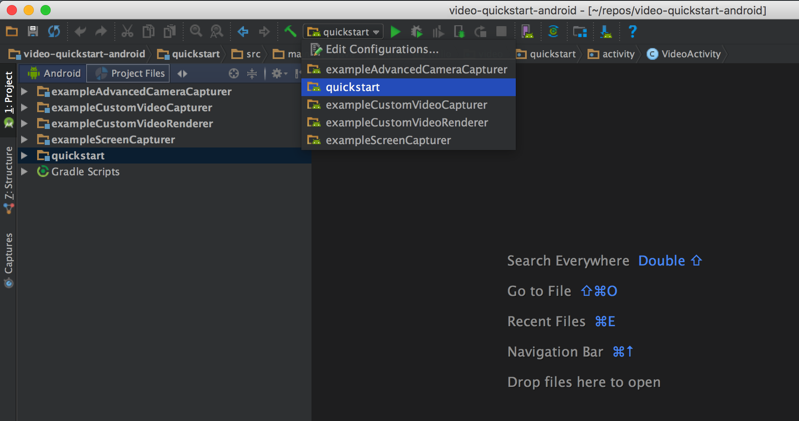
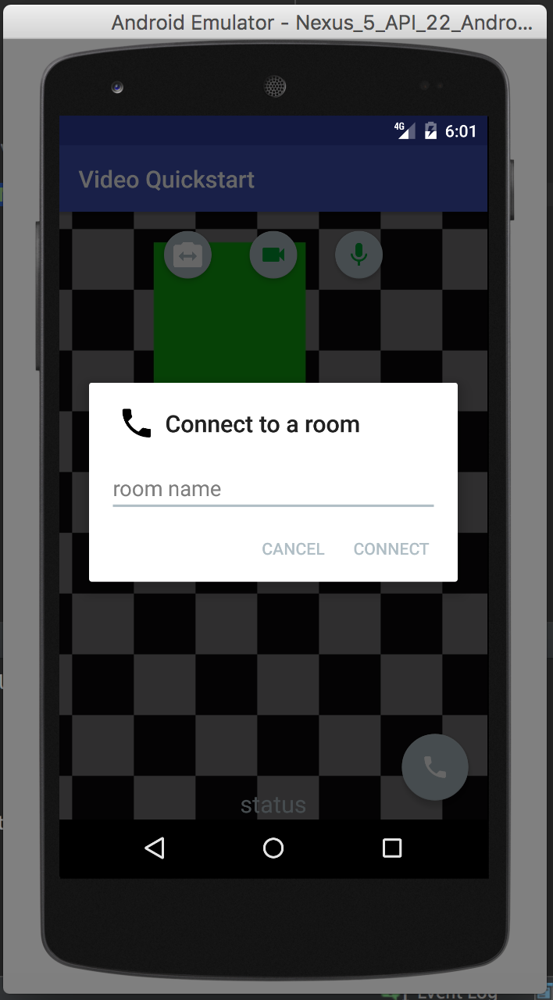

# Twilio Video Quickstart for Android

Get started with Video on Android:

- [Quickstart](#quickstart) - Run the quickstart app
- [Examples](#examples) - Customize your video experience with these examples
- [Using an Emulator](#using-an-emulator) - Setup an emulator in Android Studio
- [Reducing APK Size](#reducing-apk-size) - Use ABI splits to reduce your APK size
- [Setup an Access Token Server](#setup-an-access-token-server) - Setup an access token server
- [More Documentation](#more-documentation) - More documentation related to the Video Android SDK
- [Issues & Support](#issues-and-support) - Filing issues and general support

## Quickstart

To get started with the Quickstart application follow these steps:

1. Open this project in Android Studio and select the quickstart app module.
  
2. Type in an identity and click on "Generate Access Token" from the [testing tools page](https://www.twilio.com/user/account/video/dev-tools/testing-tools).
  
3. Paste the Access Token into the VideoActivity.java.
  
4. Run the quickstart app on an Android device or Android emulator.
5. Press the call button at the bottom right portion of the screen and type a room name to connect to a Room.
  
6. On another device, use an additional access token with a different identity to connect to the same room. 

## Examples
In addition to the quickstart we've also added a few examples of use cases that show you how to create and customize your media as follows:

- [Custom Video Capturer](exampleCustomVideoCapturer) - Demonstrates how a custom `VideoCapturer` can be implemented to capture the contents of a `View`. 
- [Custom Video Renderer](exampleCustomVideoRenderer) - Demonstrates how to implement a custom `VideoRenderer` that captures a `Bitmap` of the last rendered frame.
- [Screen Capturer](exampleScreenCapturer) - Demonstrates how to use the screen capturer.
- [Advanced Camera Capturer](exampleAdvancedCameraCapturer) - Demonstrates advanced use cases of `CameraCapturer` like injecting custom camera paremeters.

## Using an Emulator

Using an Emulator
This guide will walk you through setting up and emulator that is compatible with the Video SDK.

### Requirements
1. Android Studio 2.0+

### Guide
1. Open Android Studio and navigate to Tools → Android → AVD Manager.
  
2. Create a virtual device.
  
3. Select your desired device.
  
4. Select a system image. We recommend either x86 or x86_64 images.
  
5. Click “Show Advanced Settings” and we recommend setting both cameras as “Emulated”. Note that other camera configurations will work with the exception of setting both cameras as “webcam()”.
  
6. Configure the rest of your device accordingly and click “Finish”.

## Reducing APK Size

Our library is built using native libriares. As a result, if you use the default gradle build you will generate an APK with all four architectures(armeabi-v7a, arm64-v8a, x86, x86_64 in your APK.

[APK splits](https://developer.android.com/studio/build/configure-apk-splits.html) allow developers to build multiple APKs for different screen sizes and ABIs. Enabling APK splits ensures that the minimum amount of files required to support a particular device are packaged into an APK.

The following snippet shows an example `build.gradle` with APK splits enabled.

    apply plugin: 'com.android.application'
    
    android {
        compileSdkVersion 24
        buildToolsVersion "24.0.2"
    
        defaultConfig {
            applicationId "com.twilio.video.quickstart"
            minSdkVersion 16
            targetSdkVersion 24
            versionCode 1
            versionName "1.0"
        }
    
        // Specify that we want to split up the APK based on ABI
        splits {
            abi {
                // Enable ABI split
                enable true
    
                // Clear list of ABIs
                reset()
    
                // Specify each architecture currently supported by the Video SDK
                include "armeabi-v7a", "arm64-v8a", "x86", "x86_64"
    
                // Specify that we do not want an additional universal SDK
                universalApk false
            }
        }
    }
    
    dependencies {
        compile "com.twilio:video-android:1.0.0-beta4"
    }

The adoption of APK splits requires developers to submit multiple APKs to the Play Store. Refer to [Google’s documentation](https://developer.android.com/google/play/publishing/multiple-apks.html) for how to support this in your application.

## Setup an Access Token Server

Using Twilio's Video client within your applications requires an access token. 

You can run your own server that provides access tokens, based on your Twilio credentials. This server can either run locally on your development machine, or it can be installed on a server. If you run the server on your local machine, you should use the [ngrok](https://ngrok.com/download) utility to give the server an externally accessible web address. That way, you can run the quickstart app on an Android device.

### Configuring the Access Token Server

If you want to be a little closer to a real environment, you can download one of the video quickstart applications - for instance, [Video Quickstart: PHP](https://github.com/TwilioDevEd/video-quickstart-php) and either run it locally, or install it on a server.

You'll need to gather a couple of configuration options from your Twilio developer console before running it, so read the directions on the quickstart. You'll copy the config.example.php file to a config.php file, and then add in these credentials:
 
Credential | Description
---------- | -----------
Twilio Account SID | Your main Twilio account identifier - [find it on your dashboard](https://www.twilio.com/user/account/video).
Twilio Video Configuration SID | Adds video capability to the access token - [generate one here](https://www.twilio.com/user/account/video/profiles)
API Key | Used to authenticate - [generate one here](https://www.twilio.com/user/account/messaging/dev-tools/api-keys).
API Secret | Used to authenticate - [just like the above, you'll get one here](https://www.twilio.com/user/account/messaging/dev-tools/api-keys).

#### A Note on API Keys

When you generate an API key pair at the URLs above, your API Secret will only
be shown once - make sure to save this in a secure location.

#### Running the Video Quickstart with ngrok

If you run your video chat application on an Android device, you'll need to provide an externally accessible URL for the app. The [ngrok](https://ngrok.com/) tool creates a publicly accessible URL that you can use to send HTTP/HTTPS traffic to a server running on your localhost. Use HTTPS to make web connections that retrieve a Twilio access token.

When you get a URL from ngrok, go ahead and update VideoActivity.java with the new URL. At the very bottom is the retrieveAccessTokenfromServer() method.  If you go down this path, be sure to follow the directions in the comments in the initializeTwilioSdk() method at the top of the source file - you will need to comment out everything under "OPTION 1" and uncomment the one line under "OPTION 2". You will also need to update the code if your ngrok URL changes.

## More Documentation

You can find more documentation on getting started as well as our latest Javadoc below:

* [Getting Started](https://www.twilio.com/docs/api/video/getting-started)
* [Javadoc](https://media.twiliocdn.com/sdk/android/video/latest/docs/)

## Issues and Support

Please file any issues you find here on Github.

For general inquiries related to the Video SDK you can file a [support ticket](https://support.twilio.com/hc/en-us/requests/new)

